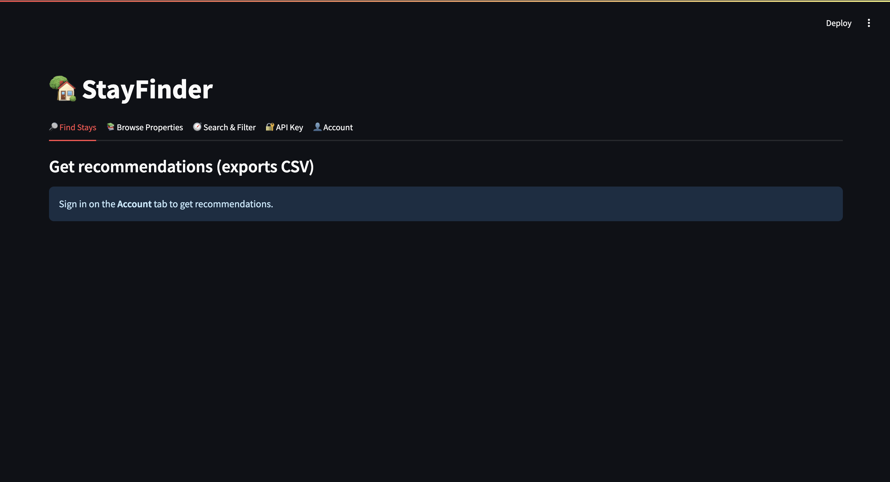
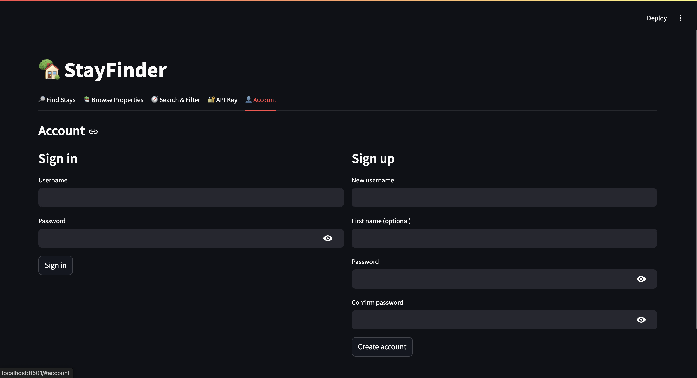
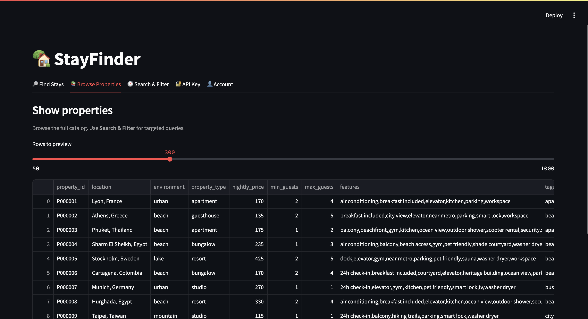
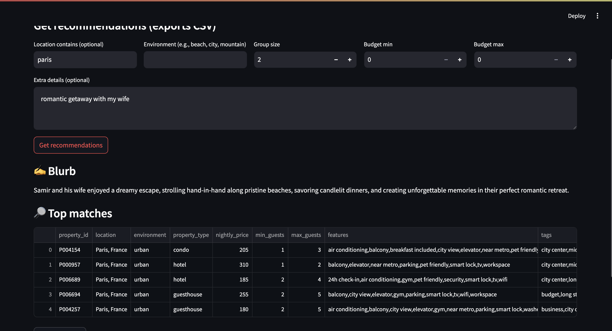
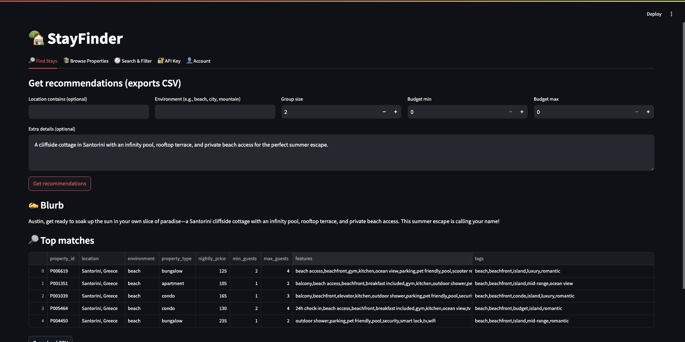
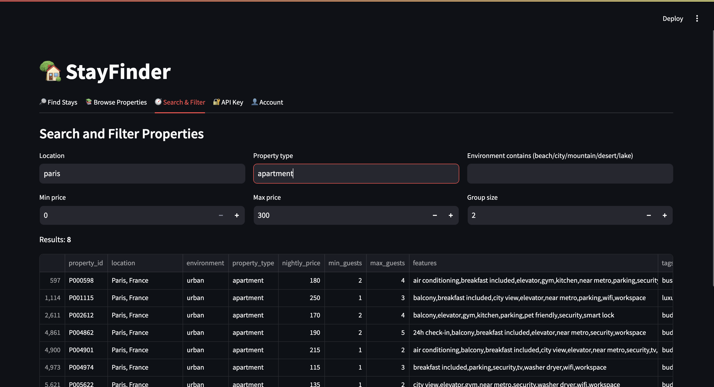
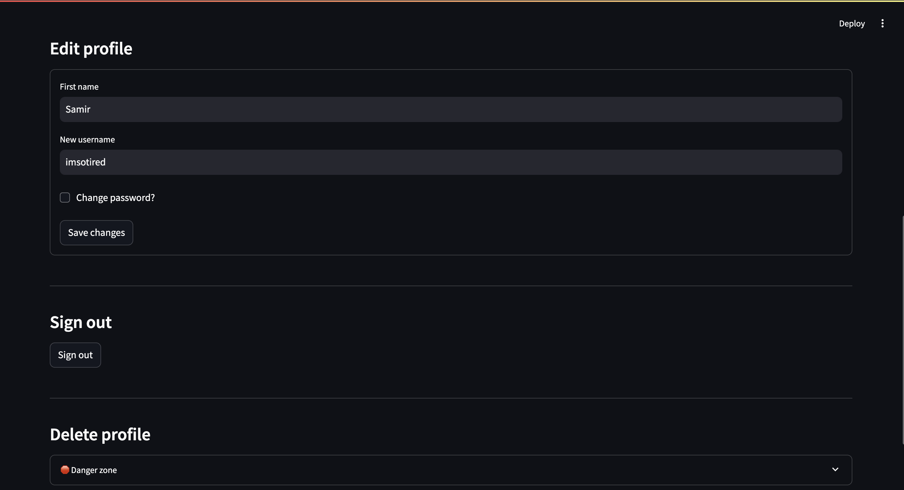
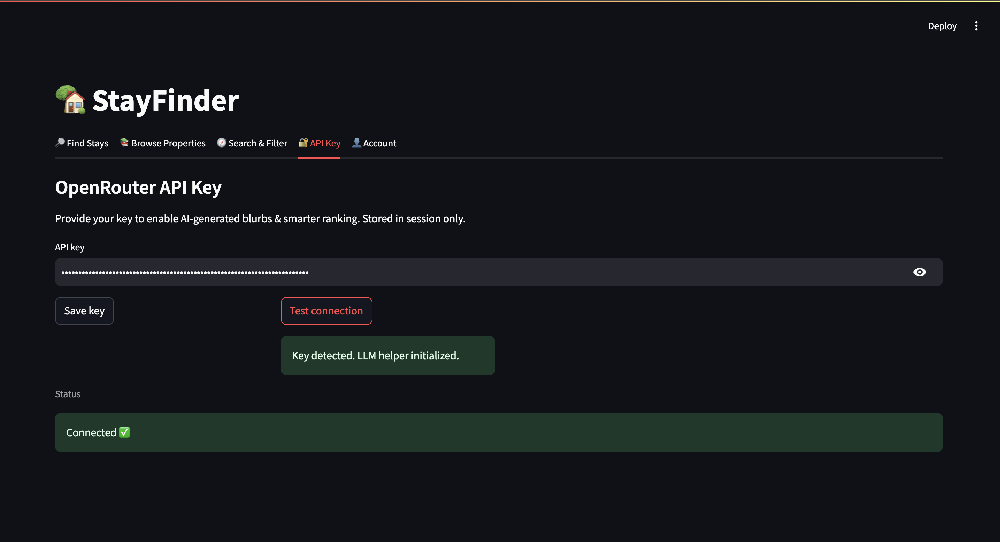

# RSM8431 — Property Recommender

A lightweight property recommendation system with a **CLI** and an optional **Streamlit UI**. It loads a sample dataset, lets users create simple profiles, runs a rules-plus-signals recommender (with optional LLM hints), and exports personalized results to CSV.

---

## Key Features

* **User profiles**: username, optional first name, password (hash-protected), and recent recommendations. Use Cases: edit/create/view/delete profile, sign in/out, and change password use cases.
* **Find Stays**: Input location, environment, group size, budget range, and additional details query to find a place with LLM integration (SmartSearch). CSV export option. Also includes a blurb about your stay generated by an LLM.
* **Search + Filter**: Filter over budget, group size, locations, and environment with simple synonym handling (LLM smart). CSV export option. 
* **Browse Properties**: Browse all avaialble properties and sort.
* **API Key**: input API key for LLM integration. Connection Test. 

---

## Project Structure

```text
.
├─ app.py                       # Streamlit UI (optional)
├─ main.py                      # CLI entrypoint (recommended for quick use)
├─ smart_search.py              # Free-text candidate finder / tag canonicalizer
├─ recommender/
│  ├─ Recommender.py            # Scoring & Top-K selection
│  ├─ llm.py                    # Stable import shim for LLM helper
│  └─ LLMHelper.py              # Optional: OpenRouter client for search hints
├─ properties/
│  └─ PropertyManager.py        # CSV loader + utilities
├─ user/
│  └─ UserManager.py            # Demo user store (salted password hashes)
├─ data/
│  ├─ property_final.csv        # Property dataset (read-only source)
│  └─ users.csv                 # User credentials (passwords are salted hashed)
├─ output/
│  └─ recommendations_*.csv     # Generated examples + your runs
├─ secrets.toml                 # (Optional) Streamlit secrets
└─ APIKEY                       # (Legacy/unused) — safe to remove
```

> Note: Your archive may include `__MACOSX/`, `__pycache__/`, `.idea/`, `.DS_Store`, and some pre-generated `output/*.csv`. They’re not required for running.

---

## Requirements

* **Python** 3.9+
* **CLI**: `pandas`
* **Streamlit UI (optional)**: `streamlit`
* **LLM hints (optional)**: `requests` and an `OPENROUTER_API_KEY`

Install the minimal set you need, e.g.:

```bash
# CLI only
pip install pandas

# CLI + Streamlit UI
pip install pandas streamlit

# Add LLM hints support
pip install requests
```

---


## Data Schema

**Source:** `data/property_final.csv`

| column          | type | example / notes                                                  |
| --------------- | ---- | ---------------------------------------------------------------- |
| `property_id`   | str  | `P000123`                                                        |
| `location`      | str  | `Phuket, Thailand`                                               |
| `environment`   | str  | e.g., `beach`, `mountain`, `city`, `lake`, `island`, `forest`, … |
| `property_type` | str  | e.g., `apartment`, `villa`, `guesthouse`, `cabin`, …             |
| `nightly_price` | int  | price per night                                                  |
| `features`      | str  | comma-separated (e.g., `WiFi, hot tub, kitchen`)                 |
| `tags`          | str  | comma-separated (e.g., `family-friendly, long stay, beachfront`) |
| `min_guests`    | int  | minimum capacity                                                 |
| `max_guests`    | int  | maximum capacity                                                 |

**Outputs** (under `output/`) add at least:

* `fit_score` – composite score; higher is better

---

## Quick Start

### Run the CLI

```bash
python main.py
```

You’ll get a simple menu to sign up/sign in, set profile details, show properties, get recommendations (exports CSV), or search/filter.

**Where results go**
`output/recommendations_<username>.csv`

### Run the Streamlit UI (optional)

```bash
streamlit run app.py
```

* Set your profile in the sidebar
* Use the search box for free-form filters (e.g., `quiet beach hot tub`)
* Download recommendations from the page

---

## Smart Search (free-text)

* Enter space-separated cues: `beach quiet wifi hot tub phuket`
* Built-in synonyms include a few helpful normalizations (e.g., `hottub` → `hot tub`, `wi-fi` → `wifi`, `downtown` → `city`).
* Search runs over a composed field from `location`, `environment`, `property_type`, `features`, and `tags`.

---

## Optional: LLM Hints (OpenRouter)

If `OPENROUTER_API_KEY` is present, the app calls a small helper that extracts structured hints (`tags`, `features`, `locations`, `environments`, `property_ids`) from your free text to slightly boost relevant items.

Alternatively, users can input their API key in the API Key Tab on Streamlit.

**Set the key (choose one):**

```bash
# Environment variable (works for CLI and Streamlit)
export OPENROUTER_API_KEY="sk-..."

# OR Streamlit secrets (add to .streamlit/secrets.toml or project secrets.toml)
[general]
OPENROUTER_API_KEY = "sk-..."
```

> If the key is missing or requests fail, the recommender still works, just without LLM boosts.

---

Recommender Logic
===============================
## 1. Data Preparation

-   The system **loads all property data** from `property_final.csv`.
-   Each property includes key fields:
    -   **ID** -- unique identifier for the property.
    -   **Location** -- city or region (e.g., Barcelona).
    -   **Type** -- condo, villa, cabin, etc.
    -   **Capacity** -- how many people it accommodates.
    -   **Price** -- nightly rate.
    -   **Tags/Features** -- amenities such as pool, beach, Wi-Fi, etc.
    -   **Environment** -- descriptors like "urban," "beach," or
        "mountain."

## 2. User Input

The recommender considers user preferences: - **Capacity** (number of
guests) - **Budget** (minimum and maximum) - **Location preference** -
**Extra details** -- analyzed by the LLM to extract relevant hints.

## 3. LLM Processing

The **LLM** (via `LLMHelper`) processes the extra details and returns
structured hints, such as:

``` json
{
  "tags": ["beach", "luxury"],
  "location": "Barcelona",
  "environment": "coastal",
  "features": ["pool", "wifi"]
}
```
All text comparisons use _tok (lower-case, strip non-alphanumerics, split to tokens). Set overlap is measured with Jaccard.

## 4. Scoring System
### Score computation (each ∈ [0,1])

1.  **Environment score** `env_score`  
    Jaccard overlap between tokens from the row (`environment`, `tags`, `property_type`) and desired tokens from the user’s `environment` plus LLM `environments`.

*   If no env given → default to 0.5.

2.  **Budget score** `budget_score`  
    Favours the midpoint:

    `max(0, 1 − |price − mid| / (max−min))`

    If no budget is provided → 0.5.

3.  **Group score** `group_score`

*   1.0 if `min_guests ≤ group_size ≤ max_guests`.
*   Else a soft decay with distance beyond the capacity range: `exp(-0.5 · dist)`.
*   No group size → 0.5.

4.  **Tag/feature score** `tag_feature_score`  
    Jaccard overlap between the LLM’s `tags+features` and a token pool built from the row (`__fulltext__`, `tags`, `features`, `environment`, `property_type`).


5.  **Location score** `location_score`  
    1.0 if any LLM `location` string is a substring of the row’s `location` (case-insensitive); otherwise fallback to token Jaccard overlap.


6.  **LLM similarity** `llm_similarity_score`  
    A broader Jaccard overlap between the row’s token pool and the union of LLM `tags + features + environments`. This captures general semantic alignment.


7.  **ID boost** `llm_id_hit`  
    If the LLM returns explicit `property_ids`, any row whose `property_id` matches (string compare) gets a fixed additive bump.

*   Weight is `id_boost_weight`.
*   This is additive and not part of the normalized blend.

## 4. Weighting Logic

Weights adapt to what the user actually supplies and what the LLM extracted:

*   Start from base weights (defaults):
    *   `env`: 0.22, `budget`: 0.22, `group`: 0.18, `tag_feature`: 0.18, `location`: 0.10, `llm_sim`: 0.10

*   Then weights are only ever assigned if a signal is present, absent signals get 0.0 weight.
*   Finally **normalize** the weights so they sum to 1.0 (the ID boost remains additive).

Final score
===========

`fit_score = w_env·env + w_budget·budget + w_group·group + w_tag_feature·tag_feature + w_location·location + w_llm_sim·llm_sim + 0.20·llm_id_hit` (additive boost)

The engine sorts by `fit_score` descending and returns the top-K (default 5) with user-facing columns (including `property_id`).

How the LLM affects ranking
===========================

*   **Directly**: via `tag_feature_score`, `location_score`, `llm_similarity_score`, and the **ID boost** if it names IDs.
    Example: if the user says “**rooftop hot tub near Barcelona**”, LLM hints likely include `tags=["hot tub"]`, `locations=["barcelona"]`. The system bumps `tag_feature` and `location` weights and those properties rise.


## 5. Output

The system returns: - **Top properties** sorted by fit score. - A
**blurb** generated by the LLM explaining why these properties match the
request. - Displayed in both the CLI (`main.py`) and the Web App
(`app.py`).


---
## Graphical User Interface (Streamlit)

#### Homepage


#### Account Homepage


#### Browse Properties Tab


#### Get Recommendations



#### Search and Filter


#### Edit + Delete Profile


#### API Integration

---


## Security & Data Notes

* `data/users.csv` stores **salted password hashes** for demo purposes only. Do **not** use real credentials.
* Treat `data/property_final.csv` as **read-only**. If you need to modify data, write to a copy.

---

## Housekeeping (.gitignore suggestion)

```gitignore
# OS/IDE
.DS_Store
__MACOSX/
.idea/

# Python
__pycache__/
*.pyc

# App outputs
output/*.csv

# Local configs (if any)
secrets.toml
.streamlit/
```

---

## Troubleshooting

* **Module not found (`pandas`/`streamlit`/`requests`)**
  → Install the listed dependencies for your chosen mode.
* **No CSV output appears**
  → Ensure `output/` exists (the app tries to create it) and you completed the menu flow.
* **LLM hints not applied**
  → Verify `OPENROUTER_API_KEY` is set. The app falls back gracefully if not.
* **Dataset path errors**
  → `main.py`/`app.py` expect `data/property_final.csv` relative to the project root.

---

## License

Academic/demo use

